# Install Diagrams

???+ soldering "Crystal Chip 1.0 Install Note"

    Crystal Chip 1.0 may use the same install diagrams as CC 1.1 and later
    HOWEVER the 1.0 does NOT use the TO (Tray Open) on v9 PS2s or later, and does 
    NOT use the HA point for any install.

    !!! soldering "SD point confusion"
        
        No installs use the SD point on the Crystal Chip if it has it. (1.1 and later)
    

## Phat PS2s

#### V1 V2 GH-004
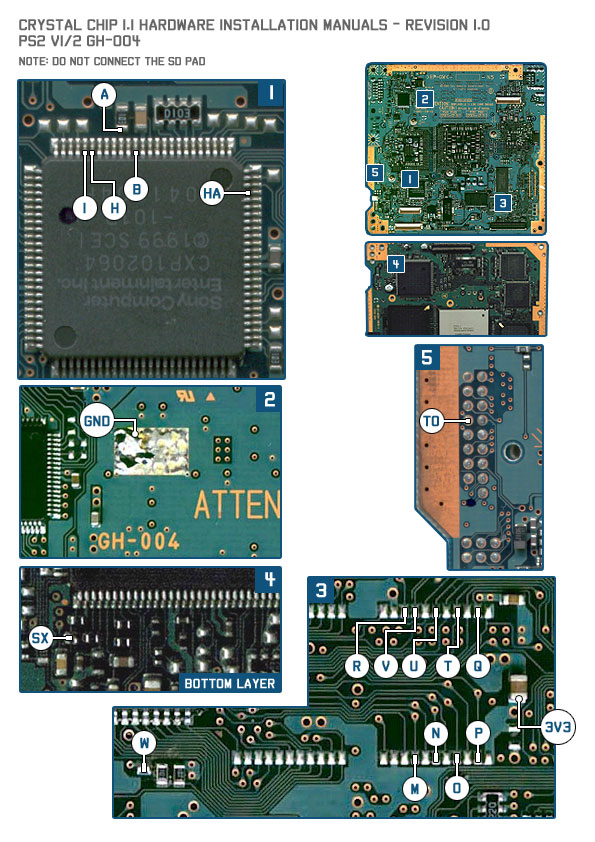{ width="800" }

#### V1 V2 GH-005
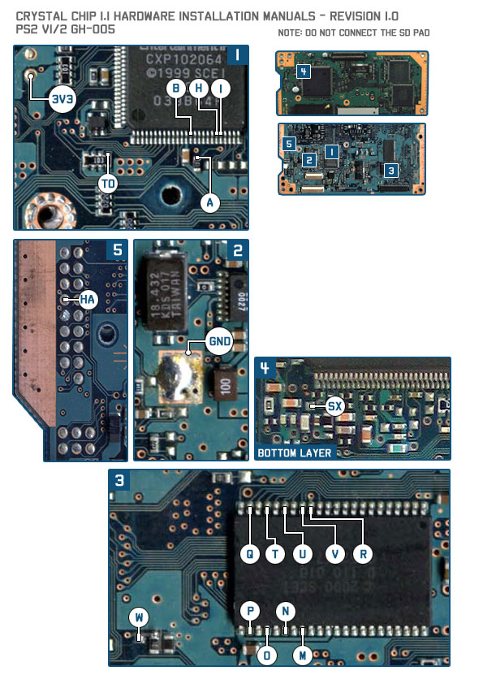{ width="800" }

#### V3
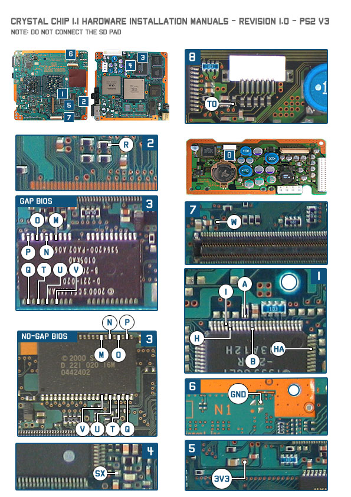{ width="800" }

#### V4
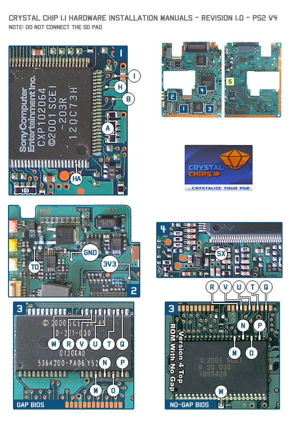{ width="800" }

#### V5 V6
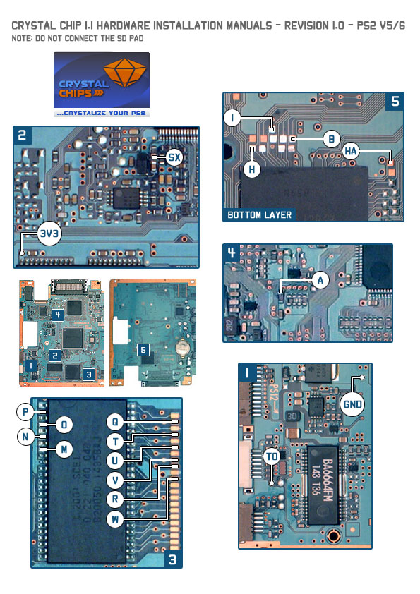{ width="800" }

#### V7 V8
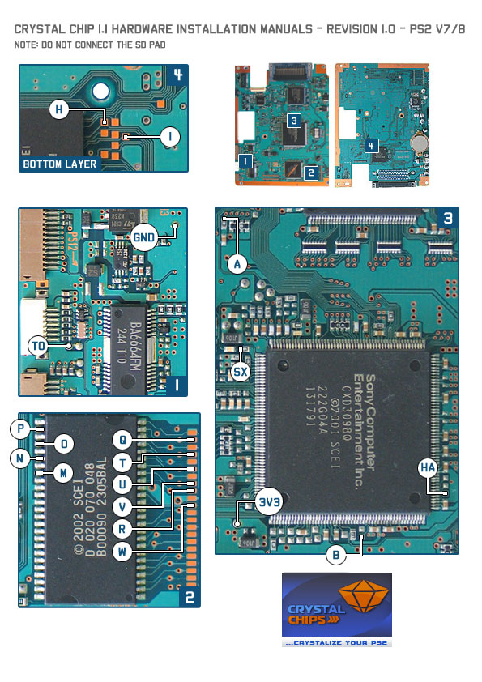{ width="800" }

#### V9
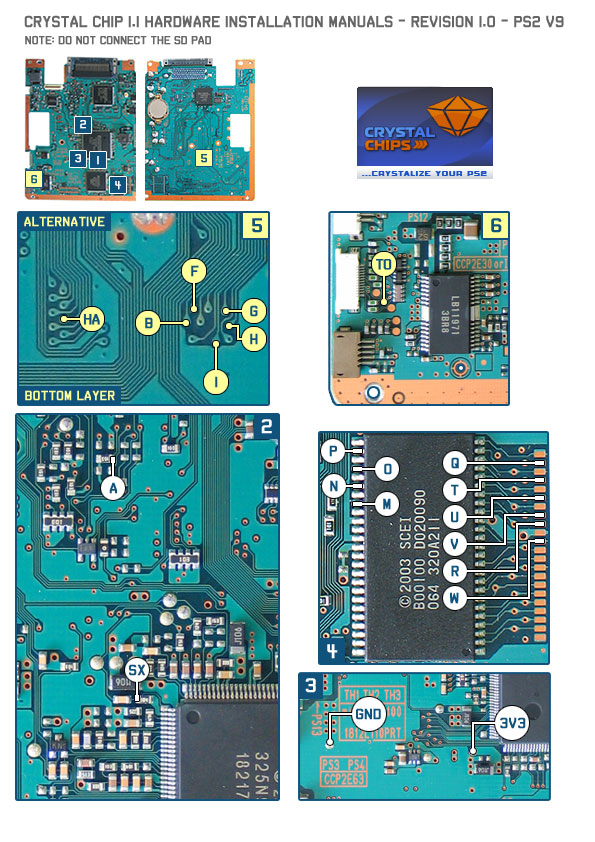{ width="800" }

#### V10 V11
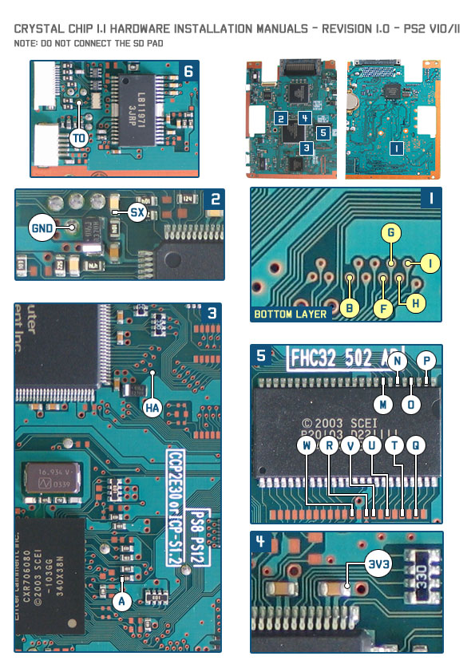{ width="800" }

## Slim PS2s

#### V12 GH-032-XX
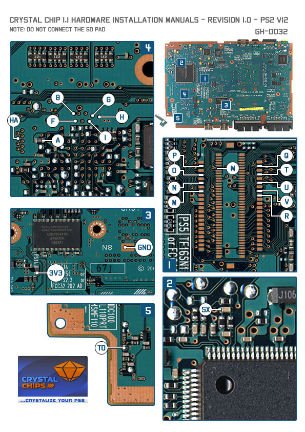{ width="800" }

#### V12 GH-035-XX
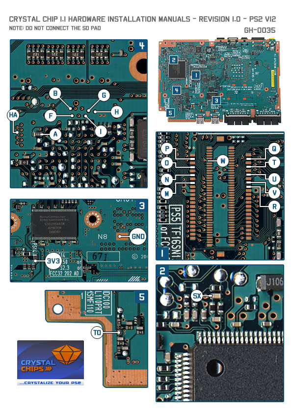{ width="800" }

#### V14 GH-037-XX
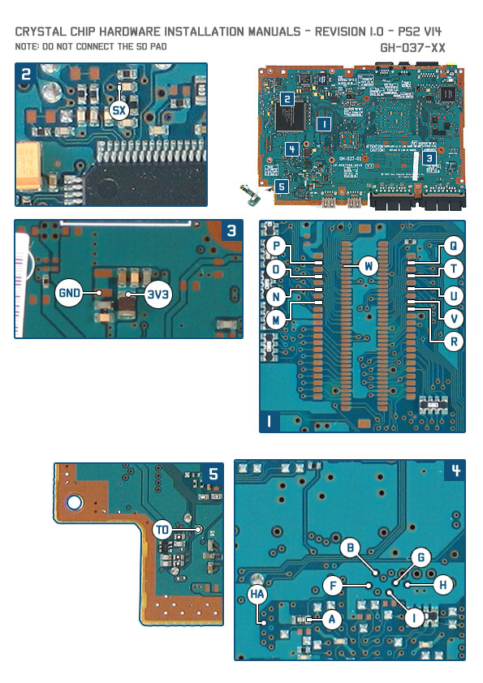{ width="800" }

#### V14 GH-041-03
{ width="800" }

#### V14 GH-040-52
{ width="800" }

#### V14 GH-040-52
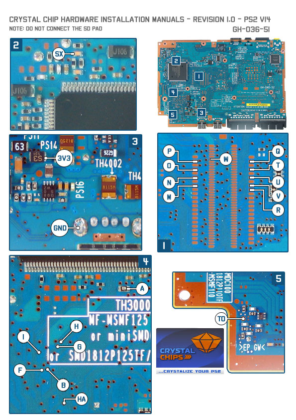{ width="800" }

#### V14 GH-036-51
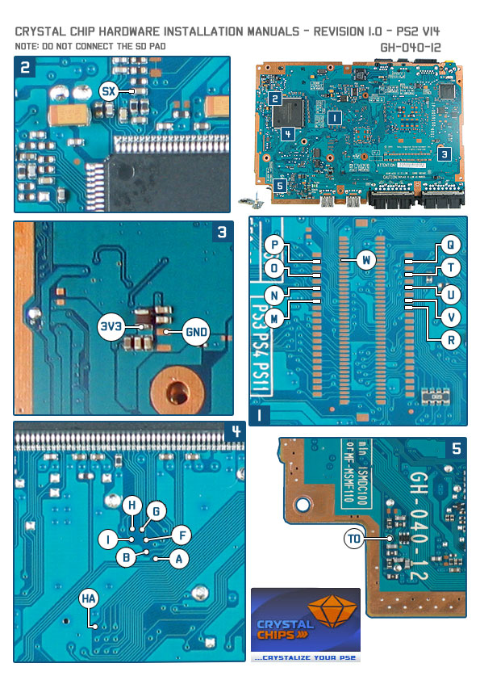{ width="800" }

#### V15 GH-051-02
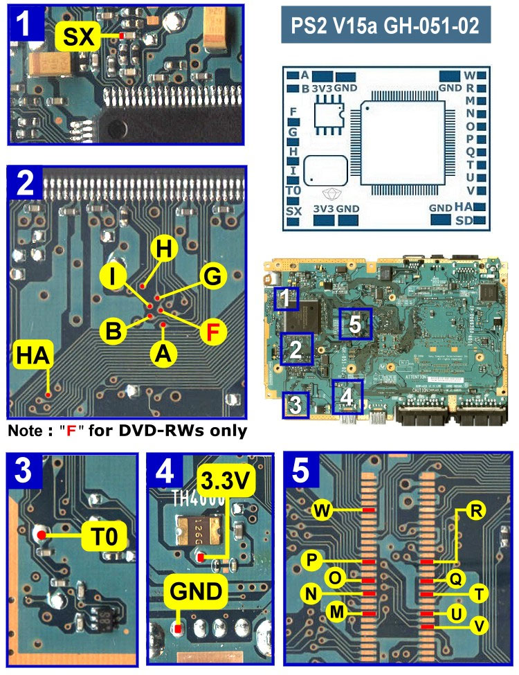{ width="800" }

#### V15 GH-051-51
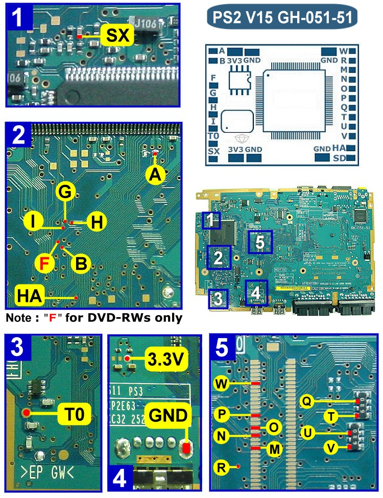{ width="800" }

#### V15 GH-061-12S
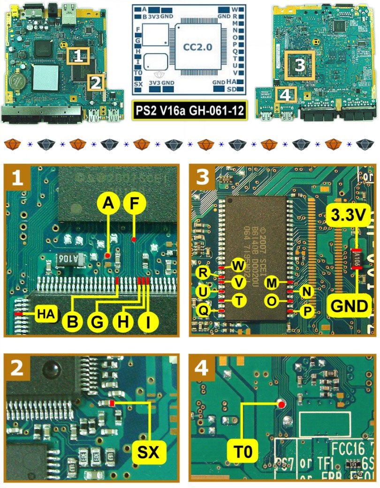{ width="800" }

