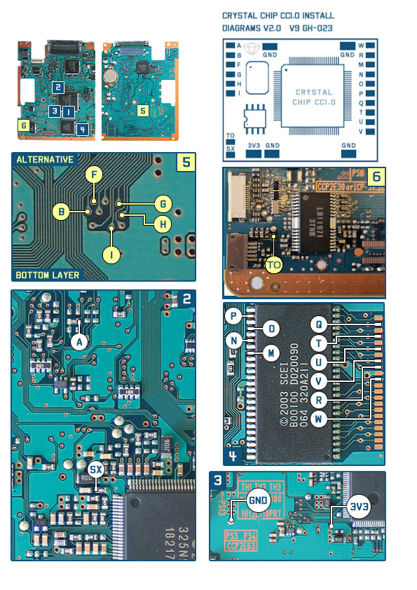

# CC 1.0 Install Diagrams

!!! soldering "Crystal Chip 1.0 Install Note"

    Crystal Chip 1.0 uses a different TO point on v1-v8 than CC 1.1 and later.

    Officially CC 1.0 does NOT use the TO (Tray Open) on v9 PS2s or later, and does 
    NOT use the HA point for any install. However I have found the TO point (TRAYSW_OUT) in the schematics.
    I have updated V9/V10 with the TO point, and plan on doing so for V12. V12 is found as well and will add here when complete. 
    Note added 05/2025
    
    For installs in V12 and later reference the [CC 1.1 and later diagrams.](cc-install.md)

    !!! soldering "SD point confusion"
        
        No installs use the SD point on the Crystal Chip if it has it. (1.1 and later)
    

## Phat PS2s

#### V1 V2 GH-004
{ width="800" }

#### V1 V2 GH-005
{ width="800" }

#### V3
{ width="800" }

#### V4
{ width="800" }

#### V5 V6
{ width="800" }

#### V7 V8
{ width="800" }

### V9 GH-023
{ width="800" }

### V10 V11 GH-026 GH-029
{ width="800" }

## Slim PS2s

## V12 GH-032 GH-035 Incoming
TO Point found, manual incoming