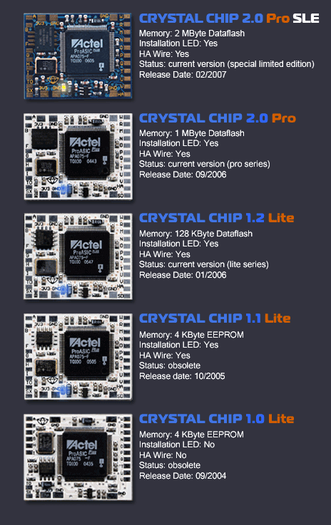

# Overview

## Crystal Chip Documentation Progress
???+ note "Progress as of 3/3/2025"

    - [ ] Crystal Chip documentation
        * [x] Install Diagrams
        * [ ] Video Tutorials
            * [x] Firmware & BootManager Installation
            * [x] Installing and Running Apps
            * [x] R34 v3 Changes (out of date), MMCE added
            * [ ] Configuration options overview
            * [ ] Adding apps not in my Megapack
            * [ ] Using PS2Client/Link to help debug
        * [ ] Written Tutorials
        * [ ] Files
            * [x] Firmware/Bootmanager
            * [ ] BM Megapack by R3Z3N
            * [x] Default APPINFO.PBT
        * [ ] PBT Scripting overview (wiki is outdated)
        * [x] Archived Websites
            * [x] Crystal Chip website
            * [x] Crystal Chip wiki

## Option to repurchase
???+ note "Option to Repurchase"

    { width="290" align=left }

    If you happened to come to this page due to this sticker then I thank you very much! 

    Please email me [here](mailto:info@ps2modchiptutorials.com) so that we may discuss futher as I would love to keep these chips in the hands of enthusiasts.


## Crystal Chip versions
    



## Dashboard "BootManager" may be installed to and ran from
| Crystal Chip | Memcard 1                       | Memcard 2                       | :material-usb: USB              | :material-harddisk: HDD          | :material-memory: On-Chip Flash                 | :material-lan-connect: PC Host |
| :----------: | :-----------------------------: | :-----------------------------: | :-----------------------------: | :-----------------------------:  | :---------------------------------------------: | :----------------------------: |
| 2.0 Pro SLE  | :material-close-circle-outline: | :material-close-circle-outline: | :material-close-circle-outline: | :material-close-circle-outline:  | :material-check-circle: 2MB Dataflash           | :material-check-circle:        |
| 2.0 Pro      | :material-close-circle-outline: | :material-close-circle-outline: | :material-close-circle-outline: | :material-close-circle-outline:  | :material-check-circle: 1MB Dataflash           | :material-check-circle:        |
| 1.2 Lite     | :material-check-circle:         | :material-check-circle:         | In Progress                     | :material-check-circle:          | :material-close-circle-outline: 128KB Dataflash | :material-check-circle:        |
| 1.1 Lite     | :material-check-circle:         | :material-check-circle:         | In Progress                     | :material-check-circle:          | :material-close-circle-outline: 4KB EEPROM      | :material-check-circle:        |
| 1.0 Lite     | :material-check-circle:         | :material-check-circle:         | In Progress                     | :material-check-circle:          | :material-close-circle-outline: 4KB EEPROM      | :material-check-circle:        |

???+ note "BootManager"
    Bootmanager therefore must be installed to either Dataflash, MemoryCard or HDD. This is not your usual Matrix Infinity.
    It is much much better

    ???+ note "Dataflash Upgrade Parts"
        
        v1.2 and later can be upgraded with 4MB dataflash: AT45DB321D-S or AT45DB321D-MW. I have several dozen in stock.
        v1.2 then would need to flash the 2.0 firmware.  Eventually I shall script to ask user if they have installed the larger dataflash.
        Go to BM/FWS/LATEST delete all but "FWARE20.CCI". Rename to "FWARE12DEV0.CCI". Then upgrade firmware choosing option 1.


## BootManager Run/Install/Remove device support
| :material-disc: CD/DVD  | :material-usb: USB Exfat/Fat | Memory Card             | :material-sd: MMCE device     | :material-harddisk: HDD | :material-lan-connect: PC Host   |
| :---------------------: | :--------------------------: | :---------------------: | :---------------------------: | :---------------------: | :------------------------------: |
| :material-check-circle: | :material-check-circle:      | :material-check-circle: | :material-alert-circle-check: | :material-check-circle: | :material-check-circle:          |

???+ note "PC Host"
    
    Use [PS2 Client](https://github.com/ps2dev/ps2client) and from where you installed/extracted run:
    ```ps2client -h hostname/ip listen```
    Homebrew must be in same folder thatn PS2 Client is running from. 
    IE: ~/PS2Client/BM/APPS/APPFOLDER/
    You still need an associated APPINFO.PBT

???+ note "MMCE devices"

    It is best to install apps to MMCE devices using your PC. It seems there are bugs such as moving files
    between mc0/1 and mmmce0/1. I hope for updated IRXs or it just may be a limitation to the SIO2 Bus.


