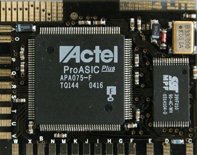
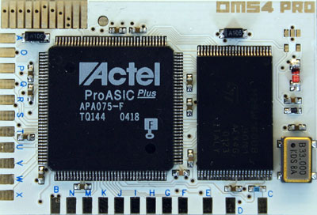
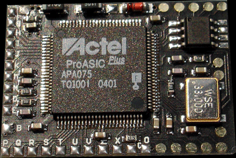

# Overview

-   __DMS4 Lite__

    ---

    { width="200" }

    v1-v10 Phat PS2 Models ONLY

-   __DMS4 Pro__

    ---

    { width="200" }

    v1-v10 Phat PS2 Models ONLY

-   __DMS4 SE Lite__

    ---

    { width="200" }

    v1-v10 Phat PS2

    v12-v14 Slim PSTwo
-   __DMS4 SE Pro__

    ---

    { width="200" }

    v1-v10 Phat PS2
    
    v12-v14 Slim PSTwo

## DMS4 Documentation Progress
???+ note "Progress as of 3/3/2025"

    - [ ] DMS4 documentation
        * [x] Install Diagrams
        * [ ] Video Tutorials
            * [ ] Firmware, Toxic Config/OS
            * [ ] Adding apps
        * [ ] Written Tutorials
        * [ ] Files
            * [ ] Recovery CDs
            * [ ] Toxic OS
        * [x] Archived Websites