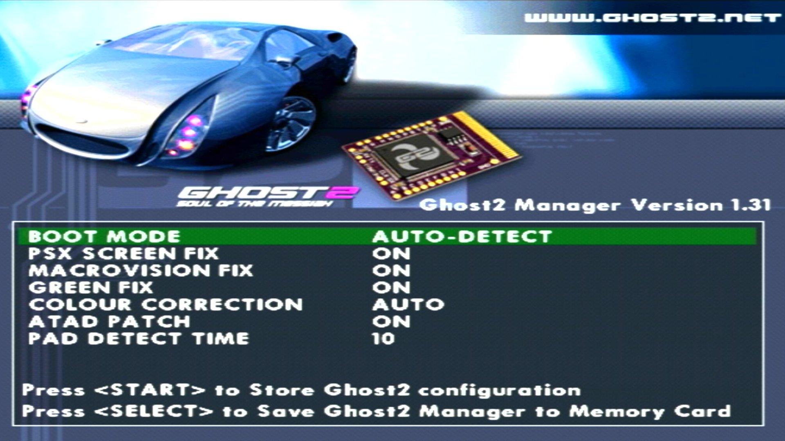

## Firmware
[:material-cloud-download: Ghost 2 NTSC Recovery FW v1.31](firmware/gh2_ntsc_sw_1.31.rar) America/ JAP

[:material-cloud-download: Ghost 2 PAL Recovery FW v1.31](firmware/gh2_pal_sw_1.31.rar) America/ PAL

[:material-cloud-alert: Ghost 2 PAL Recovery FW RC4 2.22](firmware/G2_Fw_RC4_v2-22.rar)

Press Reset 5x to boot recovery disc, each press between 1-2 seconds apart.

Keep in mind the team never finished RC4 v2.22 nor released version 2 of the Ghost 2 Firmware Manager which was planned one month before team disappeared. VW RC4 2.22 does not work fully with G2 Manager v1.30

## Ghost 2 Firmware Manager
[:material-cloud-download: G2 Manager v1.30](firmware/gh2mangr_1.30.rar)

{ width="200" }

Note: G2 Manager Version displayed was never fixed by team. Shows FW version, NOT G2 Manager version!

## Ghost 2 Eraser
[:material-cloud-download: G2 Eraser](firmware/gh2erase.rar)
