# Install Diagrams

## Phat PS2s

#### V0 V1 V2
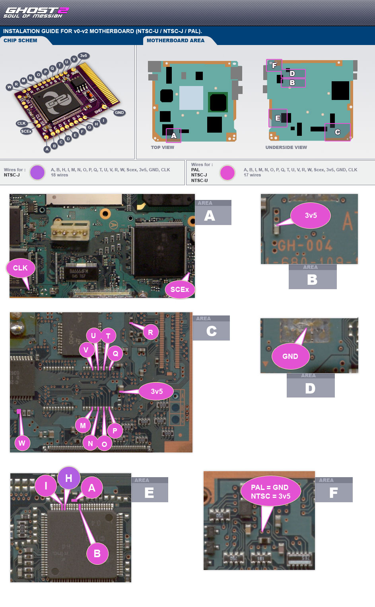{ width="800" }

#### V3
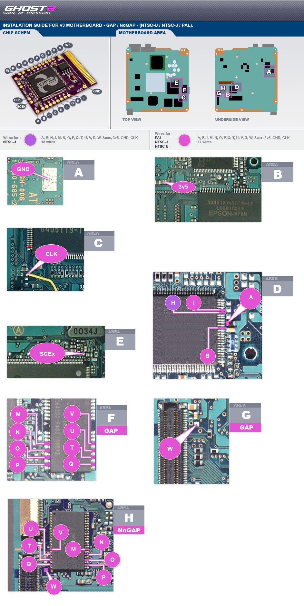{ width="800" }

#### V4
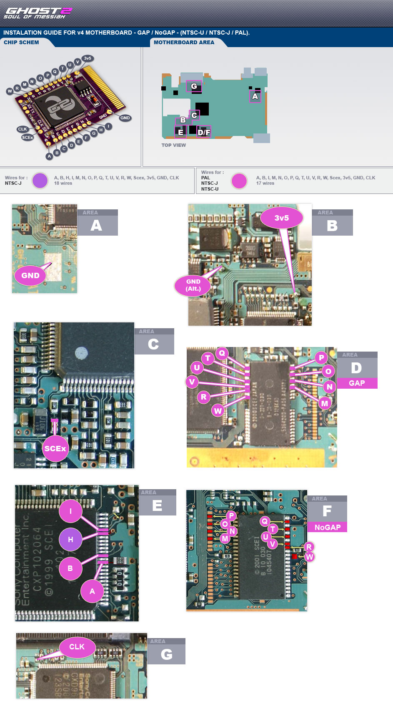{ width="800" }

#### V5 V6
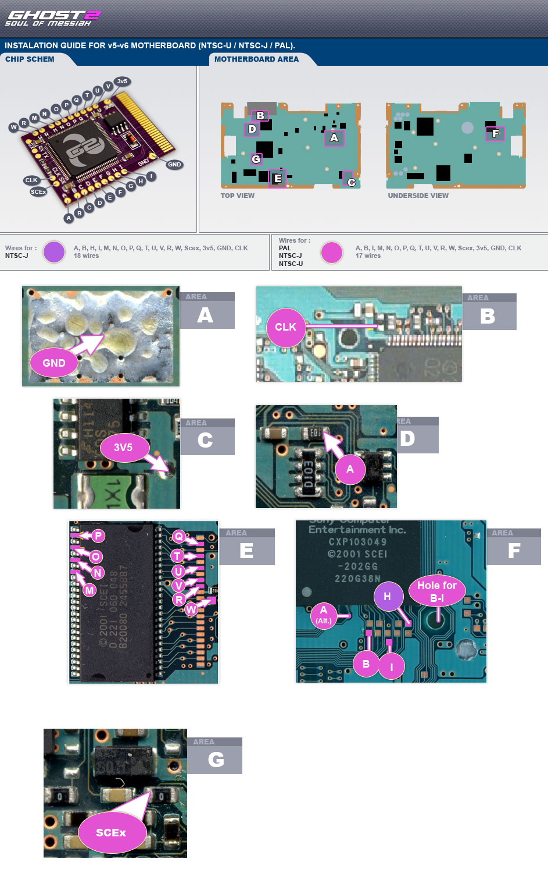{ width="800" }

#### V7
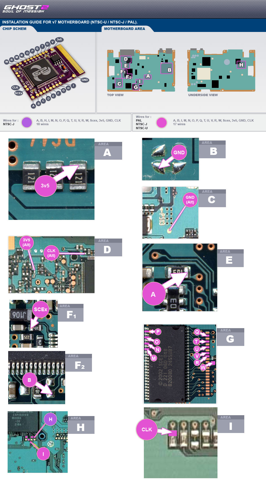{ width="800" }

#### V8
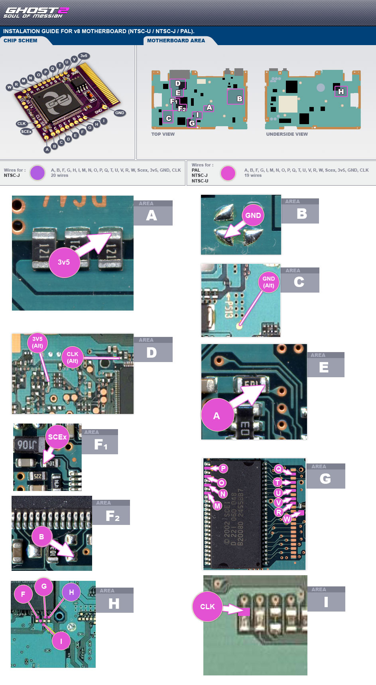{ width="800" }

#### V9
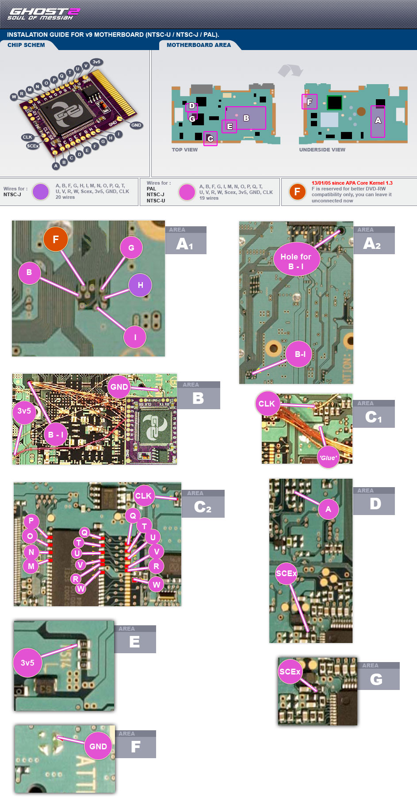{ width="800" }

#### V10 V11
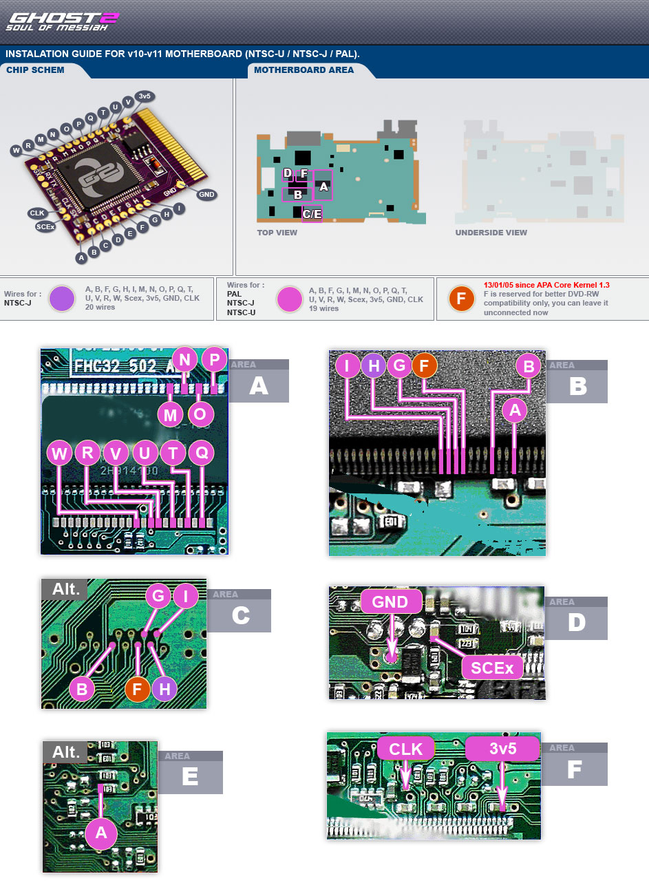{ width="800" }

## Slim PS2s

#### V12
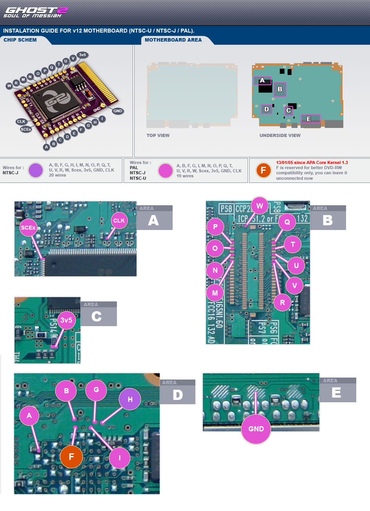{ width="800" }

#### V14 V15 Version 1
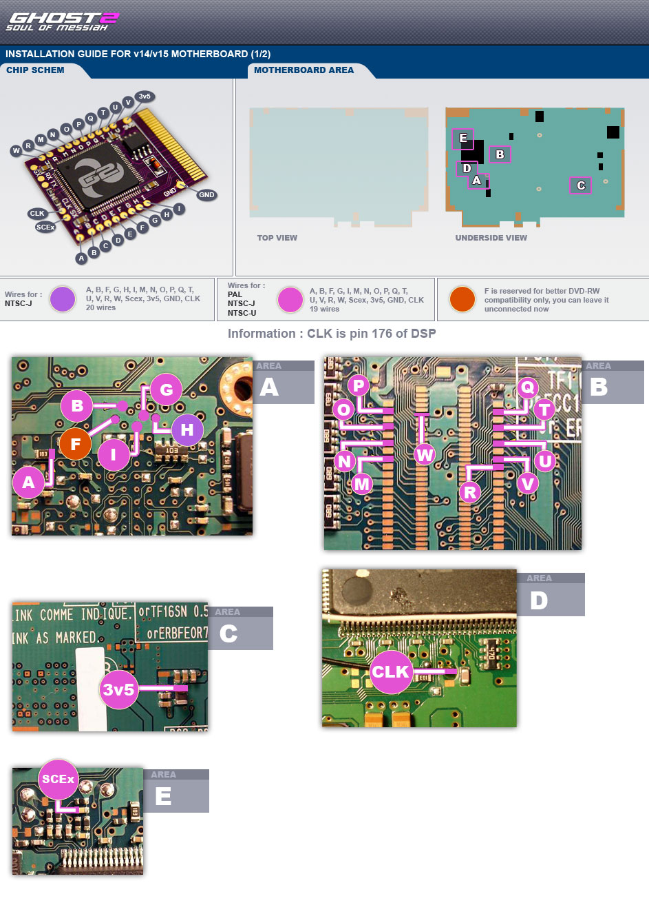{ width="800" }

#### V14 V15 Version 2
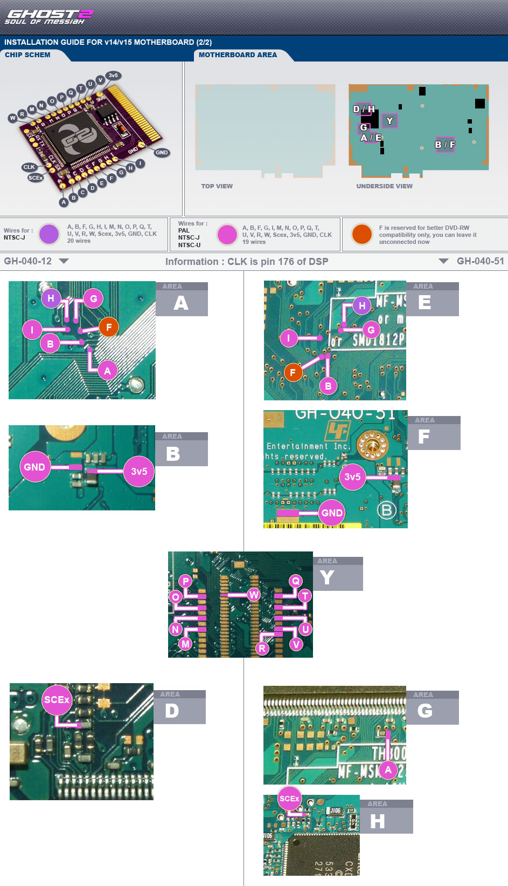{ width="800" }
