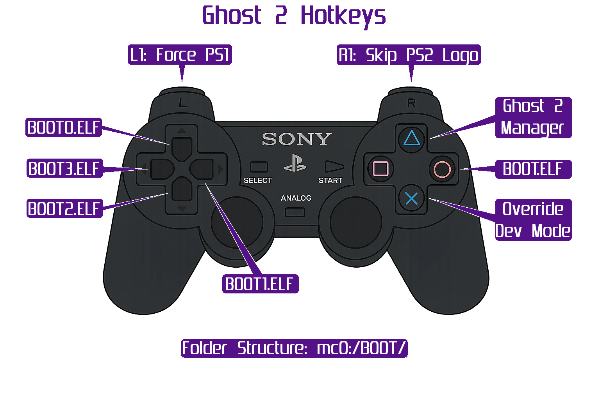

## Hotkeys:

{ width="800" }

???+ note "G2 Manager"

    G2 Manager MUST be installed on memory card 1 to access, or access via cd. In order to mak changes, boot to Flash Upgrade mode by pressing reset 4x once every blink/second.

## Boot Modes
Tap RESET button on PS2 a number of times after power up, about 1x per second. The modes are as follows from STANDBY (RED LED):

| Mode          | Number of Reset Taps | Description |
| :-----------: | :------------------: | :---------- |
| Default       | 1                    | Autodetect and all features on. |
| Ghost         | 2                    | The same as above (1) but switches chip off when the game is loaded. This is to be compatible with some homebrew. It will be activated every time you press the RESET button, but only to load the game, then it goes to sleep again. |
| Chip Off      | 3                    | Switches mod chip off completely, PS2 behaves as it has not been modified. |
| Flash Upgrade | 4                    | The same as (1) but enables write to EEPROM - in all previous modes any write/erase/modify operations are not possible because EEPROM is hardware write protected. |
| Recovery Mode | 5                    | Program EEPROM for the first time (blank EEPROM), to reprogram it if corrupted etc.  |

???+ note "Recovery Mode"

    Please note - as there are NO PATCHES applied to ps2 in recovery mode we have to use 2 version of recovery disk - one for Jap region, and one for PAL region. This is because Japanese and PAL ps2 check for "Licensed by.." string when load PSX disk (and in this case the recovery disk as a PSX disk for ps2). American machines don't do this check by some reason so you can use either Jap or PAL recovery CD. It doesn't matter which one to use as there's no differences in EEPROM file. So customers will need to download ISO image of recovery disk for either JAP or PAL region, Americans can use either of them.

## Issues

Use FW 1.31 and G2 Manager 1.30. 2.22 never had a released G2 manager that works...

Use PS2 in RGB video out else accessing PS2 Browser (OSDSYS) has no video output.