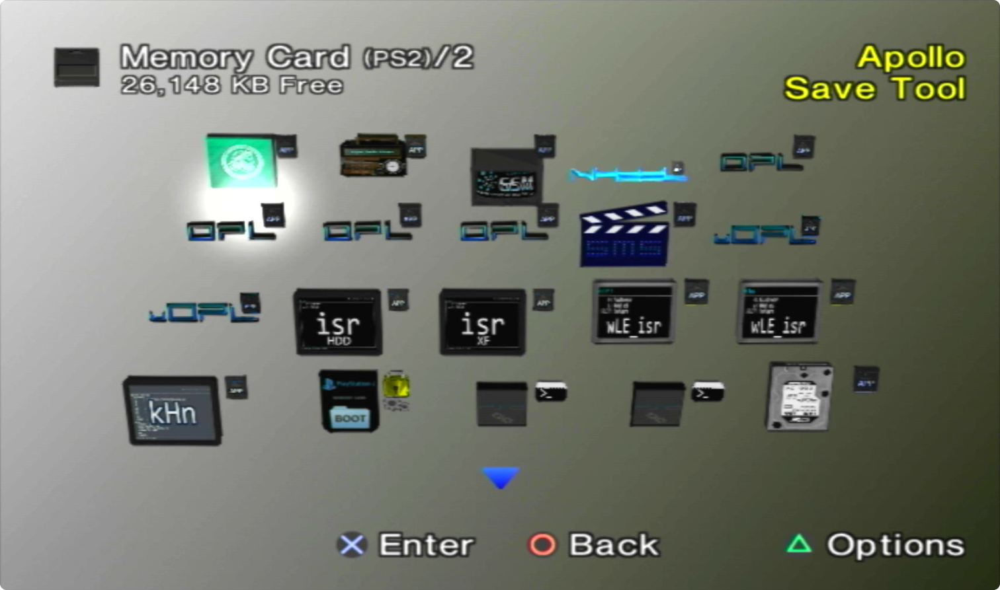
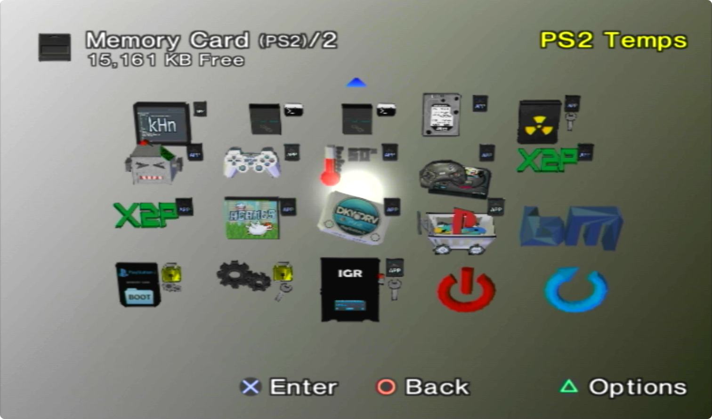

# Homebrew
<div class="grid cards" markdown>

- 
/// caption
Launch from here...
///
- 
/// caption
via OSDMenu!
///

</div>

## MegaPack Downloads
SD2PSX, PSXMemCard Gen2 and MemCardPro 2 downloads are ready to go for 3rd Gen Modchips ONLY. 

Utilizing SAS[^1] and UMCS[^2] makes updating apps EXTREMELY EASY!

There is no signed exploit[^3] like FMCB included. Why? Because not all modchips play nice with this. PS2BBL is included simply as a way to add more/consistent hotkeys across all modchips.

<div class="grid cards" markdown>

-   __USB (Fat16/32/Exfat)__

    ---

    Unzip and merge to the the root of your USB stick[^5]. Follow README.txt within.

    [:material-cloud-download: USB](https://github.com/saildot4k/ps2homebrewstore/raw/refs/heads/main/docs/assets/USB.zip)


-   __SD2PSX/PSXMemCard Gen2__

    ---

    Unzip and merge contents to root of your MMCE device (THIS WILL WIPE YOUR BOOT CARD!) MUST BE ON [FW 1.2.0 or later!](https://sd2psxtd.github.io/download)

    [:material-cloud-download: SD2PSX](https://github.com/saildot4k/ps2homebrewstore/raw/refs/heads/main/docs/assets/SD2PSX.zip)

-   __MemCardPro 2__

    ---

    Unzip and merge contents to root of your MMCE device. Set "3rd Gen Modchips" as your boot card and disable SD Card Compatibility. [Manual](https://manuals.plus/memcardpro2/mcp201-stone-age-gamer-manual#the_webui) MUST BE ON [FW 1.4.0 or later!](https://distribution.appcake.co.uk/install/8bitmods/apps/memcard-pro2/public)

    [:material-cloud-download: MCP2](https://github.com/saildot4k/ps2homebrewstore/raw/refs/heads/main/docs/assets/MEMCARDPRO2.zip)


</div>


## PS2BBL Hotkeys
My Megapacks include [PS2BBL](https://israpps.github.io/PlayStation2-Basic-BootLoader/documentation/configuration.html#launch-keys) as `mc?:/BOOT/BOOT.ELF` and [wLE ISR Exfat](https://github.com/israpps/wLaunchELF_ISR) as `mc?:/BOOT/BOOT2.ELF`

Set your modchip to boot from memory card, usually called DEV1. This is to ensure that one download works for all 3rd gen modchips that use such structure.
Prior to PS2BBL booting, your modchip firmware will determine hotkeys. Once you see the PS2BBL logo, you have 5 seconds to push a hotkey, else [OSDMenu](https://github.com/pcm720/OSDMenu) will launch, and if that is not found, wLE ISR Exfat will launch so long as you do not delete/mess up your `mc?:/BOOT` or `mc?:/SYS-CONF` folders.

See [PS2BBL](https://israpps.github.io/PlayStation2-Basic-BootLoader/documentation/configuration.html#launch-keys) for documentation.

!!! example "PS2BBL Hotkeys @ `mc?:/SYS-CONF/PS2BBL.INI`"

    ```
    # PlayStation2 Basic Bootloader config file
    # configurations:
    SKIP_PS2LOGO = 1
    EJECT_TRAY = 0
    OSDHISTORY_READ = 0
    KEY_READ_WAIT_TIME = 5000
    LOGO_DISPLAY = 2

    # APPLICATIONS:

    LK_AUTO_E1 = mc?:/SYS_OSDMENU/osdmenu.elf
    LK_AUTO_E2 = mc?:/BOOT/osdmenu.elf
    LK_AUTO_E3 = mc?:/BOOT/BOOT2.ELF

    LK_START_E1 = $CDVD

    LK_SELECT_E1 = $CDVD_NO_PS2LOGO

    LK_TRIANGLE_E1 = mc?:/APP_WLE-ISR-XF-MM/WLE-ISR-XF-MM.ELF
    LK_TRIANGLE_E2 = mc?:/APP_WLE-ISR-XF/WLE-ISR-XF.ELF
    LK_TRIANGLE_E3 = mc?:/BOOT/BOOT2.ELF

    LK_R1_E1 = mmce?:/NEUTRINO/nhddl.elf
    LK_R1_E2 = mc?:/APP_NHDDL/nhddl.elf
    LK_R1_E3 = mc?:/NEUTRINO/nhddl.elf

    LK_R2_E1 = mc?:/APP_OPL-120B2210/OPL-120B2210.ELF
    LK_R2_E2 = mc?:/APP_OPL-120B2049GID/OPL-120B2049GID.ELF

    LK_L1_E1 = hdd0:__system:pfs:/p2lboot/PSBBN.ELF
    LK_L1_E2 = hdd0:__system:pfs:/osdmenu/hosdmenu.elf
    LK_L1_E3 = hdd0:__boot:pfs:/boot.elf

    LK_L2_E1 = mc?:/APP_OPL-MMCE-BETA3/OPL-MMCE-BETA3.ELF
    LK_L2_E2 = mc?:/APP_OPL-MMCE-BETA2/OPL-MMCE-BETA2.ELF
    ```

    !!! warning "Emergency Mode"

        If something breaks on your setup but PS2BBL still boots, just hold `R1+START`. It will trigger emergency mode where PS2BBL will try to boot `RESCUE.ELF` from USB device Root on an endless loop. Recommended to rename wLE ISR Exfat to `RESCUE.ELF`


## Apps as of 7/23/2025:

| Application                  | USB (Fat16/32/Exfat)            | MMCE Device VMC                   |
| :----------------------------| :-----------------------------: | :-------------------------------: |
| Crystal Chips BootManager    | :material-close-circle:         | :material-check-circle:           |
| BM Themes                    | :material-check-circle:         | :material-check-circle:           |
| Apollo Save Tool             | :material-check-circle:         | :material-check-circle:           |
| GSM                          | :material-check-circle:         | :material-check-circle:           |
| NHDDL (edit OSDMENU.INI)     | :material-check-circle:         | :material-check-circle:           |
| OPL 1.2.0 B2049 GID          | :material-check-circle:         | :material-check-circle:           |
| OPL 1.2.0 B2210              | :material-check-circle:         | :material-check-circle:           |
| OPL MMCE Beta 3              | :material-check-circle:         | :material-check-circle:           |
| OPL MMCE Beta 2              | :material-check-circle:         | :material-check-circle:           |
| Simple Media System          | :material-check-circle:         | :material-check-circle:           |
| unoffical OPL                | :material-check-circle:         | :material-check-circle:           |
| unofficial OPL Betrayal      | :material-check-circle:         | :material-check-circle:           |
| wLE ISR HDD                  | :material-check-circle:         | :material-check-circle:           |
| wLE ISR XF MM                | :material-check-circle:         | :material-check-circle:           |
| wLE ISR XF MX                | :material-check-circle:         | :material-check-circle:           |
| wLE KHN                      | :material-check-circle:         | :material-check-circle:           |
| wLE XFW                      | :material-check-circle:         | :material-check-circle:           |
| BOOT Folder for other chips  | :material-check-circle:         | :material-check-circle:           |
| PS2 Link                     | :material-check-circle:         | :material-check-circle:           |
| PS2 Link Highloading         | :material-check-circle:         | :material-check-circle:           |
| PS2 HDD Checker              | :material-check-circle:         | :material-check-circle:           |
| Memory Card Annihilator      | :material-check-circle:         | :material-check-circle:           |
| Mechacon Crash Tester        | :material-check-circle:         | :material-check-circle:           |
| Pad Tester                   | :material-check-circle:         | :material-check-circle:           |
| PS2 HDD Tester               | :material-check-circle:         | :material-check-circle:           |
| PS2 Temps                    | :material-check-circle:         | :material-check-circle:           |
| PicoDrvie                    | :material-check-circle:         | :material-check-circle:           |
| Xbox 2 PS2                   | :material-check-circle:         | :material-check-circle:           |
| Xbox 2 PS2 Lite              | :material-check-circle:         | :material-check-circle:           |
| HERMES                       | :material-check-circle:         | :material-check-circle:           |
| OSDMenu (in BOOT folder)     | :material-check-circle:         | :material-check-circle:           |
| PowerOff                     | :material-check-circle:         | :material-check-circle:           |
| Restart                      | :material-check-circle:         | :material-check-circle:           |
| DKWDRV                       | :material-check-circle:         | :material-check-circle:           |
| POPSLOADER                   | :material-check-circle:         | :material-check-circle:           |
| Restart                      | :material-check-circle:         | :material-check-circle:           |
| IGR to Boot Card             | :material-check-circle:         | :material-check-circle:           |
| SYS-CONF                     | :material-check-circle:         | :material-check-circle:           |
| NEUTRINO                     | :material-check-circle: USB Root| :material-check-circle: MMCE root |
| RETROLauncher (USB)          | :material-check-circle: USB Root| :material-check-circle-outline:   |
| OSD-XMB (USB)                | :material-check-circle: USB Root| :material-check-circle-outline:   |
| XEB+ (USB) NEEDS INSTALL     | :material-close-circle-outline: USB Root | :material-close-circle-outline:   |

!!! tip "NHDDL"

    NHDDL supports ArgV which decreases boot time. Edit `mc:/SYS-CONF/OSDMENU.CNF` as needed. See [NHDDL](https://github.com/pcm720/nhddl?tab=readme-ov-file#passing-arguments) and [OSDMenu](https://github.com/pcm720/OSDMenu?tab=readme-ov-file#fmcb-handler) docs.


!!! tip "Missing App Notes"

    - XEB+ Xmas Edition must be acquired from official sources due to license
        - Can only be ran from USB!
    - RetroLauncher is unable to be burned to CD so it is not included on the CD installer.
        - Can only be ran from USB!
    - OSDXMB can only be ran from USB!


[^1]: [Save Application System](https://ps2wiki.github.io/sas-apps-archive/) Icons courtesy of koraxial, Ripto, Berion and Yornn
[^2]: 
    [Universal Memory Card Structure](https://ps2wiki.github.io/sas-apps-archive/psu-categories/umcs.html) `mc?:/BOOT` and `mc?:/SYS-CONF` structure that utilizes PS2BBL as BOOT.ELF and wLE ISR Exfat as BOOT2.ELF. Failover configs for both exist in SYS-CONF along with any other common file type shared between apps such as IPCONFIG.DAT
[^3]: 
    [FMCB](https://israpps.github.io/FreeMcBoot-Installer/), [FHDB](https://israpps.github.io/FreeMcBoot-Installer/test/FHDB-TUTO.html), [FDVDB](https://github.com/CTurt/FreeDVDBoot), [OpenTuna](https://github.com/ps2homebrew/opentuna-installer) and [PS2BBL](https://israpps.github.io/PlayStation2-Basic-BootLoader/) are signed exploits. They take advantage of a vulnurability in the PS2 update mechanism to autoboot an ELF(s) via memory card or internal hard drive[^4]
[^4]: 
    Internal Hard Drives are compatible with all models up to SCPH-700XX. Recommend [Offical Sony Network Adapter](https://www.psdevwiki.com/ps2/Network_Adaptor) and Bitfunx Sata Upgrade for Phats, or [iFlash2PS2](https://arthrimus.com/product/iflash2ps2-flex-kit/) for SCPH-700XX Slim
[^5]: Crystal Chip BM and DMS3/4 Toxic OS do not support Exfat. Use MBR/Fat32, otherwise supported in homebrew such as wLE ISR Exfat.