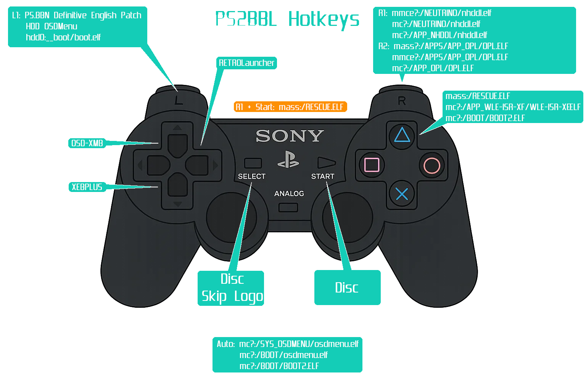

# Homebrew

- 
/// caption
Launch from here...
///
- 
/// caption
via OSDMenu!
///

## MegaPack Downloads
SD2PSX, PSXMemCard Gen2 and MemCardPro 2 downloads are ready to go for 3rd Gen Modchips ONLY. 

Utilizing SAS[^1] and UMCS[^2] makes updating apps EXTREMELY EASY!

There is no signed exploit[^3] like FMCB included. Why? Because not all modchips play nice with this. PS2BBL is included simply as a way to add more/consistent hotkeys across all modchips.

-   __USB (Fat16/32/Exfat)__

    ---

    Unzip and merge to the the root of your USB stick[^5]. Follow README.txt within.

    [:material-cloud-download: USB](https://github.com/saildot4k/ps2homebrewstore/raw/refs/heads/main/docs/assets/USB.zip)

-   __SD2PSX/PSXMemCard Gen2__

    ---

    Unzip and merge contents to root of your MMCE device (THIS WILL WIPE YOUR BOOT CARD!) MUST BE ON [FW 1.2.0 or later!](https://sd2psxtd.github.io/download)

    [:material-cloud-download: SD2PSX](https://github.com/saildot4k/ps2homebrewstore/raw/refs/heads/main/docs/assets/SD2PSX.zip)

-   __MemCardPro 2__

    ---

    Unzip and merge contents to root of your MMCE device. Set "3rd Gen Modchips" as your boot card and disable SD Card Compatibility. [Manual](https://manuals.plus/memcardpro2/mcp201-stone-age-gamer-manual#the_webui) MUST BE ON [FW 1.4.0 or later!](https://distribution.appcake.co.uk/install/8bitmods/apps/memcard-pro2/public)

    [:material-cloud-download: MCP2](https://github.com/saildot4k/ps2homebrewstore/raw/refs/heads/main/docs/assets/MEMCARDPRO2.zip)

## PS2BBL Hotkeys
My Megapacks include [PS2BBL](https://israpps.github.io/PlayStation2-Basic-BootLoader/documentation/configuration.html#launch-keys) as `mc?:/BOOT/BOOT.ELF` and [wLE ISR Exfat](https://github.com/israpps/wLaunchELF_ISR) as `mc?:/BOOT/BOOT2.ELF`

Set your modchip to boot from memory card, usually called DEV1. This is to ensure that one download works for all 3rd gen modchips that use such structure.
Prior to PS2BBL booting, your modchip firmware will determine hotkeys. Once you see the PS2BBL logo, you have 5 seconds to push a hotkey, else [OSDMenu](https://github.com/pcm720/OSDMenu) will launch, and if that is not found, wLE ISR Exfat will launch so long as you do not delete/mess up your `mc?:/BOOT` or `mc?:/SYS-CONF` folders.

See [PS2BBL](https://israpps.github.io/PlayStation2-Basic-BootLoader/documentation/configuration.html#launch-keys) for documentation.

{ width="800" }
/// caption
Config @ mc?:/SYS-CONF/PS2BBL.INI
///

!!! warning "Emergency Mode"

    If something breaks on your setup but PS2BBL still boots, just hold `R1+START`. It will trigger emergency mode where PS2BBL will try to boot `RESCUE.ELF` from USB device Root on an endless loop. Recommended to rename wLE ISR Exfat to `RESCUE.ELF`

??? example "PS2BBL.INI, OSDMENU.CNF and LAUNCHELF contents"

    

    === "PS2BBL.INI"

        # PlayStation2 Basic Bootloader config file
        # configurations:
        SKIP_PS2LOGO = 1
        EJECT_TRAY = 0
        OSDHISTORY_READ = 0
        KEY_READ_WAIT_TIME = 5000
        LOGO_DISPLAY = 2

        # APPLICATIONS:

        LK_AUTO_E1 = mc?:/SYS_OSDMENU/osdmenu.elf
        LK_AUTO_E2 = mc?:/BOOT/osdmenu.elf
        LK_AUTO_E3 = mc?:/BOOT/BOOT2.ELF

        LK_START_E1 = $CDVD

        LK_SELECT_E1 = $CDVD_NO_PS2LOGO

        LK_TRIANGLE_E1 = mc?:/APP_WLE-ISR-XF-MM/WLE-ISR-XF-MM.ELF
        LK_TRIANGLE_E2 = mc?:/APP_WLE-ISR-XF/WLE-ISR-XF.ELF
        LK_TRIANGLE_E3 = mc?:/BOOT/BOOT2.ELF

        LK_R1_E1 = mmce?:/NEUTRINO/nhddl.elf
        LK_R1_E2 = mc?:/APP_NHDDL/nhddl.elf
        LK_R1_E3 = mc?:/NEUTRINO/nhddl.elf

        LK_R2_E1 = mc?:/APP_OPL-120B2210/OPL-120B2210.ELF
        LK_R2_E2 = mc?:/APP_OPL-120B2049GID/OPL-120B2049GID.ELF

        LK_L1_E1 = hdd0:hdd0:__system:pfs:/p2lboot/PSBBN.ELF
        LK_L1_E2 = hdd0:__system:pfs:/osdmenu/hosdmenu.elf
        LK_L1_E3 = hdd0:__boot:pfs:/boot.elf

        LK_L2_E1 = mc?:/APP_OPL-MMCE-BETA3/OPL-MMCE-BETA3.ELF
        LK_L2_E2 = mc?:/APP_OPL-MMCE-BETA2/OPL-MMCE-BETA2.ELF

    === "OSDMENU.CNF"

        hacked_OSDSYS = 1
        OSDSYS_video_mode = AUTO
        OSDSYS_Inner_Browser = 0
        OSDSYS_Browser_Launcher = 1
        OSDSYS_selected_color = 0x10,0x80,0xE0,0x80
        OSDSYS_unselected_color = 0x33,0x33,0x33,0x80
        OSDSYS_scroll_menu = 1
        OSDSYS_menu_x = 320
        OSDSYS_menu_y = 110
        OSDSYS_enter_x = 30
        OSDSYS_enter_y = -1
        OSDSYS_version_x = -1
        OSDSYS_version_y = -1
        OSDSYS_cursor_max_velocity = 1500
        OSDSYS_cursor_acceleration = 150
        OSDSYS_left_cursor =
        OSDSYS_right_cursor =
        OSDSYS_menu_top_delimiter = EDIT AS NEEDED
        OSDSYS_menu_bottom_delimiter = 3rd Gen Modchips
        OSDSYS_num_displayed_items = 20
        OSDSYS_Skip_MC = 1
        OSDSYS_Skip_HDD = 1
        OSDSYS_Skip_Disc = 1
        OSDSYS_Skip_Logo = 1
        cdrom_skip_ps2logo = 1
        cdrom_disable_gameid = 0
        cdrom_use_dkwdrv = 0
        ps1drv_enable_fast = 1
        ps1drv_enable_smooth = 1
        ps1drv_use_ps1vn = 0
        # path_custom_payload = hdd0:__system:pfs:/p2lboot/PSBBN.ELF
        # boot_custom_payload = 1
        path_DKWDRV_ELF = mc?:/PS1_DKWDRV/DKWDRV.ELF
        # --------------------------------------------------
        name_OSDSYS_ITEM_1 = Launch Disc
        path1_OSDSYS_ITEM_1 = cdrom
        arg_OSDSYS_ITEM_1 = -nologo
        # --------------------------------------------------
        # --------------------------------------------------
        name_OSDSYS_ITEM_2 = NHDDL - MMCE & Exfat HDD
        path1_OSDSYS_ITEM_2 = mc?:/APP_NHDDL/nhddl.elf
        path2_OSDSYS_ITEM_2 = mmce?:/APPS/nhddl.elf
        path3_OSDSYS_ITEM_2 = usb:/APPS/nhddl.elf
        arg_OSDSYS_ITEM_2 = -mode=mmce
        arg_OSDSYS_ITEM_2 = -mode=exfat
        # --------------------------------------------------
        name_OSDSYS_ITEM_3 = OPL MMCE b3
        path1_OSDSYS_ITEM_3 = mc?:/APP_OPL-MMCE-BETA3/OPL-MMCE-BETA3.ELF
        path2_OSDSYS_ITEM_3 = mmce?:/APPS/APP_OPL-MMCE-BETA3/OPL-MMCE-BETA3.ELF
        path3_OSDSYS_ITEM_3 = usb:/APPS/APP_OPL-MMCE-BETA3/OPL-MMCE-BETA3.ELF
        # --------------------------------------------------
        name_OSDSYS_ITEM_4 = OPL 1.2.0 b2238
        path1_OSDSYS_ITEM_4 = mc?:/APP_OPL-120B2238/OPL-120B2238.ELF
        path2_OSDSYS_ITEM_4 = mmce?:/APPS/APP_OPL-120B2238/OPL-120B2238.ELF
        path3_OSDSYS_ITEM_4 = usb:/APPS/APP_OPL-120B2238/OPL-120B2238.ELF
        # --------------------------------------------------
        name_OSDSYS_ITEM_5 = OPL 1.2.0 b2210
        path1_OSDSYS_ITEM_5 = mc?:/APP_OPL-120B2210/OPL-120B2210.ELF
        path2_OSDSYS_ITEM_5 = mmce?:/APPS/APP_OPL-120B2210/OPL-120B2210.ELF
        path3_OSDSYS_ITEM_5 = usb:/APPS/APP_OPL-120B2210/OPL-120B2210.ELF
        # --------------------------------------------------
        name_OSDSYS_ITEM_6 = OPL 1.2.0 b2049GID
        path1_OSDSYS_ITEM_6 = mc?:/APP_OPL-120B2049GID/OPL-120B2049GID.ELF
        path2_OSDSYS_ITEM_6 = mmce?:/APPS/APP_OPL-120B2049GID/OPL-120B2049GID.ELF
        path3_OSDSYS_ITEM_6 = usb:/APPS/APP_OPL-120B2049GID/OPL-120B2049GID.ELF
        # --------------------------------------------------
        name_OSDSYS_ITEM_7 = OPL 1.2.0 uOPL
        path1_OSDSYS_ITEM_7 = mc?:/APP_UOPL/UOPL.ELF
        path2_OSDSYS_ITEM_7 = mmce?:/APP_UOPL/UOPL.ELF
        path3_OSDSYS_ITEM_7 = usb:/APPS/APP_UOPL/UOPL.ELF
        # --------------------------------------------------
        name_OSDSYS_ITEM_8 = OPL 1.2.0 uOPL Betrayal
        path1_OSDSYS_ITEM_8 = mc?:/APP_UOPL-BETRAYAL/UOPL-BETRAYAL.ELF
        path2_OSDSYS_ITEM_8 = mmce?:/APP_UOPL-BETRAYAL/UOPL-BETRAYAL.ELF
        path3_OSDSYS_ITEM_8 = usb:/APPS/APP_UOPL-BETRAYAL/UOPL-BETRAYAL.ELF
        # --------------------------------------------------
        # --------------------------------------------------
        name_OSDSYS_ITEM_9 = wLE ISR ExFat USB
        path1_OSDSYS_ITEM_9 = mc?:/APP_WLE-ISR-XF/WLE-ISR-XF.ELF
        path2_OSDSYS_ITEM_9 = mmce?:/APPS/APP_WLE-ISR-XF/WLE-ISR-XF.ELF
        path3_OSDSYS_ITEM_9 = usb:/APPS/APP_WLE-ISR-XF/WLE-ISR-XF.ELF
        # --------------------------------------------------
        name_OSDSYS_ITEM_10 = wLE ISR ExFat USB / MMCE
        path1_OSDSYS_ITEM_10 = mc?:/APP_WLE-ISR-XF-MM/WLE-ISR-XF-MM.ELF
        path2_OSDSYS_ITEM_1- = mmce?:/APPS/APP_WLE-ISR-XF-MM/WLE-ISR-XF-MM.ELF
        path3_OSDSYS_ITEM_10 = usb:/APPS/APP_WLE-ISR-XF-MM/WLE-ISR-XF-MM.ELF
        # --------------------------------------------------
        name_OSDSYS_ITEM_11 = wLE ISR ExFat USB / MX4SIO
        path1_OSDSYS_ITEM_11 = mc?:/APP_WLE-ISR-XF-MX/WLE-ISR-XF-MX.ELF
        path2_OSDSYS_ITEM_11 = mmce?:/APPS/APP_WLE-ISR-XF-MX/WLE-ISR-XF-MX.ELF
        path3_OSDSYS_ITEM_11 = usb:/APPS/APP_WLE-ISR-XF-MX/WLE-ISR-XF-MX.ELF
        # --------------------------------------------------
        name_OSDSYS_ITEM_12 = wLE ISR HDD
        path1_OSDSYS_ITEM_12 = mc?:/APP_WLE-ISR-HDD/WLE-ISR-HDD.ELF
        path2_OSDSYS_ITEM_12 = mmce?:/APPS/APP_WLE-ISR-HDD/WLE-ISR-HDD.ELF
        path3_OSDSYS_ITEM_12 = usb:/APPS/APP_WLE-ISR-HDD/WLE-ISR-HDD.ELF
        # --------------------------------------------------
        # --------------------------------------------------
        name_OSDSYS_ITEM_249 = Reload OSDMenu
        path1_OSDSYS_ITEM_249 = mc?:/BOOT/BOOT.ELF
        # --------------------------------------------------
        name_OSDSYS_ITEM_250 = Shutdown
        path1_OSDSYS_ITEM_250 = POWEROFF
        # --------------------------------------------------

    === "LAUNCHELF.CNF

        CNF_version = 3
        LK_auto_E1 = MISC/OSDSYS
        LK_Circle_E1 = MISC/About uLE
        LK_Cross_E1 = MISC/FileBrowser
        LK_Square_E1 = MISC/HddManager
        LK_Triangle_E1 = MISC/TextEditor
        LK_L1_E1 = MISC/PS2Disc
        LK_R1_E1 = MISC/PS2PowerOff
        LK_L2_E1 = mc:/BOOT/ESR.EL
        LK_R2_E1 = mc:/BOOT/osdmenu.elf
        LK_L3_E1 = MISC/Debug Info
        LK_R3_E1 = mc:/BOOT/BOOT.ELF
        LK_Start_E1 =
        LK_Select_E1 = MISC/Configure
        Misc = MISC/
        Misc_PS2Disc = PS2Disc
        Misc_FileBrowser = FileBrowser
        Misc_PS2Browser = PS2Browser
        Misc_PS2Net = PS2Net
        Misc_PS2PowerOff = PS2PowerOff
        Misc_HddManager = HddManager
        Misc_TextEditor = TextEditor
        Misc_JpgViewer = JpgViewer
        Misc_Configure = Configure
        Misc_Load_CNFprev = Load CNF--
        Misc_Load_CNFnext = Load CNF++
        Misc_Set_CNF_Path = Set CNF_Path
        Misc_Load_CNF = Load CNF
        Misc_ShowFont = ShowFont
        Misc_Debug_Info = Debug Info
        Misc_About_uLE = About uLE
        Misc_Show_Build_Info = BuildInfo
        Misc_OSDSYS = OSDSYS
        GUI_Col_1_ABGR = 00000000
        GUI_Col_2_ABGR = 00000000
        GUI_Col_3_ABGR = 00FFCE6C
        GUI_Col_4_ABGR = 00A0A0A0
        GUI_Col_5_ABGR = 00707070
        GUI_Col_6_ABGR = 00808080
        GUI_Col_7_ABGR = 00C0C0C0
        GUI_Col_8_ABGR = 00858585
        SKIN_FILE =
        GUI_SKIN_FILE =
        SKIN_Brightness = 50
        TV_mode = 0
        Screen_Offset_X = 0
        Screen_Offset_Y = 0
        Popup_Opaque = 1
        Menu_Frame = 1
        Show_Menu = 1
        LK_auto_Timer = 120
        Menu_Hide_Paths = 1
        Menu_Pages = 1
        GUI_Swap_Keys = 1
        NET_HOSTwrite = 0
        Menu_Title = wLaunchELF-Check About Page For Version
        Init_Delay = 0
        USBKBD_USED = 1
        REBOOT_IOP_ELFLOAD = 1
        USBKBD_FILE =
        KBDMAP_FILE =
        Menu_Show_Titles = 1
        PathPad_Lock = 0
        CNF_Path =
        LANG_FILE =
        FONT_FILE =
        JpgView_Timer = 5
        JpgView_Trans = 2
        JpgView_Full = 0
        PSU_HugeNames = 0
        PSU_DateNames = 0
        PSU_NoOverwrite = 0
        FB_NoIcons = 0
        LK_auto_Title = Exit to PS2(OSDSYS)
        LK_Circle_Title = About wLaunchELF(Version)
        LK_Cross_Title = File Browser, Applications, and Tools(wLE/MISC)
        LK_Square_Title = Internal HDD/SSD Manager(HDDManager)
        LK_Triangle_Title = Text/Code Tool(TextEditor)
        LK_L1_Title = Launch Disc(PS2Disc)
        LK_R1_Title = Shut Down PS2(PS2PowerOff)
        LK_L2_Title = Launch ESR Patched Disc(ESR Launcher)
        LK_R2_Title = Exit to PS2 MC Browser(OSDMenu / OSDSYS)
        LK_L3_Title = PS2 BootROM Info(Debug Info)
        LK_R3_Title = Exit to PS2BBL(BOOT.ELF)
        LK_Select_Title = wLaunchELF Settings (Configure)
        PathPad_Lock = 0

    

## Apps as of 7/23/2025:

| Application                  | USB (Fat16/32/Exfat)            | MMCE Device VMC                   |
| :----------------------------| :-----------------------------: | :-------------------------------: |
| Crystal Chips BootManager    | :material-close-circle:         | :material-check-circle:           |
| BM Themes                    | :material-check-circle:         | :material-check-circle:           |
| Apollo Save Tool             | :material-check-circle:         | :material-check-circle:           |
| GSM                          | :material-check-circle:         | :material-check-circle:           |
| NHDDL (edit OSDMENU.INI)     | :material-check-circle:         | :material-check-circle:           |
| OPL 1.2.0 B2049 GID          | :material-check-circle:         | :material-check-circle:           |
| OPL 1.2.0 B2210              | :material-check-circle:         | :material-check-circle:           |
| OPL 1.2.0 B2238              | :material-check-circle:         | :material-check-circle:           |
| OPL MMCE Beta 3              | :material-check-circle:         | :material-check-circle:           |
| OPL MMCE Beta 2              | :material-check-circle:         | :material-check-circle:           |
| Simple Media System          | :material-check-circle:         | :material-check-circle:           |
| unoffical OPL                | :material-check-circle:         | :material-check-circle:           |
| unofficial OPL Betrayal      | :material-check-circle:         | :material-check-circle:           |
| wLE ISR HDD                  | :material-check-circle:         | :material-check-circle:           |
| wLE ISR XF MM                | :material-check-circle:         | :material-check-circle:           |
| wLE ISR XF MX                | :material-check-circle:         | :material-check-circle:           |
| wLE KHN                      | :material-check-circle:         | :material-check-circle:           |
| wLE XFW                      | :material-check-circle:         | :material-check-circle:           |
| BOOT Folder for other chips  | :material-check-circle:         | :material-check-circle:           |
| PS2 Link                     | :material-check-circle:         | :material-check-circle:           |
| PS2 Link Highloading         | :material-check-circle:         | :material-check-circle:           |
| PS2 HDD Checker              | :material-check-circle:         | :material-check-circle:           |
| Memory Card Annihilator      | :material-check-circle:         | :material-check-circle:           |
| Mechacon Crash Tester        | :material-check-circle:         | :material-check-circle:           |
| Pad Tester                   | :material-check-circle:         | :material-check-circle:           |
| PS2 HDD Tester               | :material-check-circle:         | :material-check-circle:           |
| PS2 Temps                    | :material-check-circle:         | :material-check-circle:           |
| PicoDrvie                    | :material-check-circle:         | :material-check-circle:           |
| Xbox 2 PS2                   | :material-check-circle:         | :material-check-circle:           |
| Xbox 2 PS2 Lite              | :material-check-circle:         | :material-check-circle:           |
| HERMES                       | :material-check-circle:         | :material-check-circle:           |
| OSDMenu (in BOOT folder)     | :material-check-circle:         | :material-check-circle:           |
| PowerOff                     | :material-check-circle:         | :material-check-circle:           |
| Restart                      | :material-check-circle:         | :material-check-circle:           |
| DKWDRV                       | :material-check-circle:         | :material-check-circle:           |
| POPSLOADER                   | :material-check-circle:         | :material-check-circle:           |
| Restart                      | :material-check-circle:         | :material-check-circle:           |
| IGR to Boot Card             | :material-check-circle:         | :material-check-circle:           |
| SYS-CONF                     | :material-check-circle:         | :material-check-circle:           |
| NEUTRINO                     | :material-check-circle: USB Root| :material-check-circle: MMCE root |
| RETROLauncher (USB)          | :material-check-circle: USB Root| :material-check-circle-outline:   |
| OSD-XMB (USB)                | :material-check-circle: USB Root| :material-check-circle-outline:   |
| XEB+ (USB) NEEDS INSTALL     | :material-close-circle-outline: USB Root | :material-close-circle-outline:   |

!!! tip "NHDDL"

    NHDDL supports ArgV which decreases boot time. Edit `mc:/SYS-CONF/OSDMENU.CNF` as needed. See [NHDDL](https://github.com/pcm720/nhddl?tab=readme-ov-file#passing-arguments) and [OSDMenu](https://github.com/pcm720/OSDMenu?tab=readme-ov-file#fmcb-handler) docs.

!!! tip "Missing App Notes"

    - XEB+ Xmas Edition must be acquired from official sources due to license
        - Can only be ran from USB!
    - RetroLauncher is unable to be burned to CD so it is not included on the CD installer.
        - Can only be ran from USB!
    - OSDXMB can only be ran from USB!

[^1]: [Save Application System](https://ps2wiki.github.io/sas-apps-archive/) Icons courtesy of koraxial, Ripto, Berion and Yornn
[^2]: 
    [Universal Memory Card Structure](https://ps2wiki.github.io/sas-apps-archive/psu-categories/umcs.html) `mc?:/BOOT` and `mc?:/SYS-CONF` structure that utilizes PS2BBL as BOOT.ELF and wLE ISR Exfat as BOOT2.ELF. Failover configs for both exist in SYS-CONF along with any other common file type shared between apps such as IPCONFIG.DAT
[^3]: 
    [FMCB](https://israpps.github.io/FreeMcBoot-Installer/), [FHDB](https://israpps.github.io/FreeMcBoot-Installer/test/FHDB-TUTO.html), [FDVDB](https://github.com/CTurt/FreeDVDBoot), [OpenTuna](https://github.com/ps2homebrew/opentuna-installer) and [PS2BBL](https://israpps.github.io/PlayStation2-Basic-BootLoader/) are signed exploits. They take advantage of a vulnurability in the PS2 update mechanism to autoboot an ELF(s) via memory card or internal hard drive[^4]
[^4]: 
    Internal Hard Drives are compatible with all models up to SCPH-700XX. Recommend [Offical Sony Network Adapter](https://www.psdevwiki.com/ps2/Network_Adaptor) and Bitfunx Sata Upgrade for Phats, or [iFlash2PS2](https://arthrimus.com/product/iflash2ps2-flex-kit/) for SCPH-700XX Slim
[^5]: Crystal Chip BM and DMS3/4 Toxic OS do not support Exfat. Use MBR/Fat32, otherwise supported in homebrew such as wLE ISR Exfat.