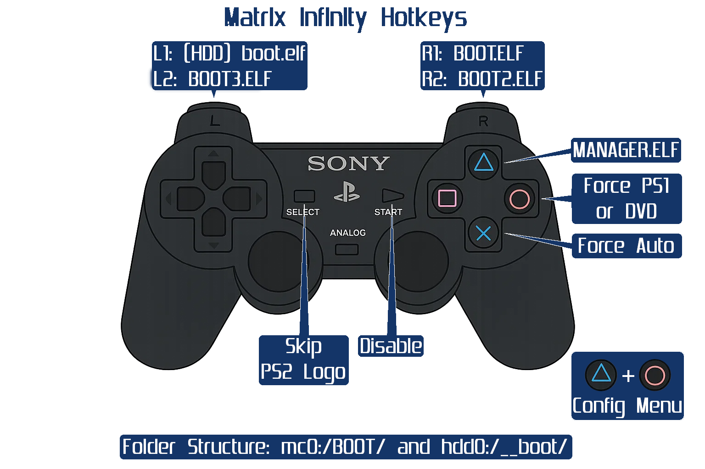

## Hotkeys

=== "Matrix Infinity FW"

    { width="800" }

=== "PS2BBL"

    { width="800" }
    /// caption
    Config @ mc?:/SYS-CONF/PS2BBL.INI
    ///

???+ note "Infinity Manager"

    Infinity Manager, which may be installed to mc0:/BOOT/MANAGER.ELF is another menu that needs a config file to define a few more boot options.
    Due to homebrew as of late such as OSDMenu and PS2BBL, instead of using Infinity Manager, one can name another homebrew to MANAGER.ELF for one more added hotkey.

## Boot Modes
To enter recovery mode:

V1-V12 and V14 PAL: Hold the reset button until the blue eject light turns on.

V14 and later USA and JAP:

    - USA : Hold reset until blue eject lights turn on, wait 3 seconds and tap reset again.

    - JAP : Hold reset until blue eject lights turn on, wait 3 seconds and tap reset, wait 3 more
seconds and tap reset again. 

## Infinity option configuration menu :

Press TRIANGLE + CIRCLE to enter the configuration menu.

PS2 SCREEN FIX:

 - OFF: Disables PS2 video fix.

 - COLOR: Games will be output on their original video mode (PAL/NTSC)
with color correction applied to match your PS2 region.

 - PAL: Force video mode to PAL

 - NTSC: Force video mode to NTSC

 - PAL60: Force all games to NTSC with color correction.
Games will run faster but screen might need adjusting.

 - VGA: Enable 640x480 VGA mode.

Y SCREEN FIX:

 - OFF: Y screen position fix is disabled.

 - AUTO: Y position fix enabled with default settings.
Should be fine for most television sets. 

 - +/- N: Fine tune Y position. Positive values move the screen down, Negative values move it up.

PSX SCREEN FIX   : ON/OFF : Enable/Disable PSX screen fix

PSX MULTI DISK   : ON/OFF : Enable/Disable PSX multi disk support

MC16 PATCH       : ON/OFF : Enable/Disable D4TEL memory card support

ATAD AUTO PATCH  : ON/OFF : Enable/Disable ATAD auto patch

MACROVISION FIX  : ON/OFF : Enable/Disable Macrovision patch

GREEN FIX        : ON/OFF : Enable/Disable green correction on DVD movies

DVD VIDEO REGION : 1-8   : Selects the DVD player region. Use it to match the corresponding region on RCE protected discs.

DVD9 DL SUPPORT  : ON/OFF : Enable/Disable Double Layer patch

BOOT MODE:
 - AUTO: Normal behaviour. All discs wil autoboot.

 - FAST: FastBoot. Skips logo. Same as pressing SELECT on boot.

 - INFMAN: Execute Infinity Manager at mc0:/BOOT/MANAGER.ELF. Same as Pressing TRIANGLE on boot.

 - DEV1: Execute BOOT.ELF at mc0:/BOOT/. Same as Pressing R1 on boot.
 
 - DEV2: Execute BOOT.ELF on HDD. Same as Pressing L1 on boot.
 
 - DVDV: Force DVD video mode. Same as Pressing CIRCLE on boot.

PAD DETECT TIME  : 2-10  : Select time to wait for connected pad on boot. Only useful if pad is left unconnected.

BOOT LOGO        : ON/OFF : Enable/Disable Matrix boot logo.
