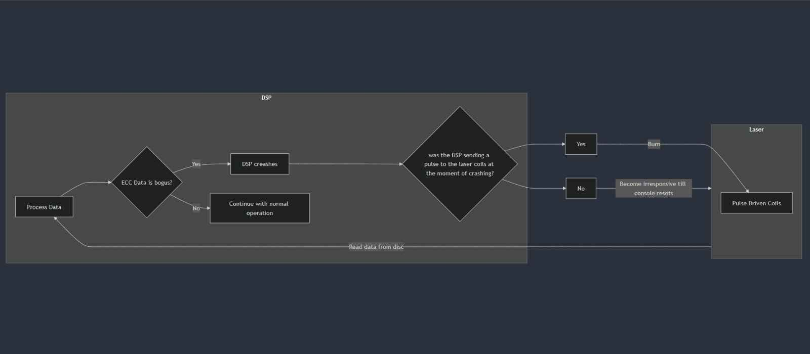
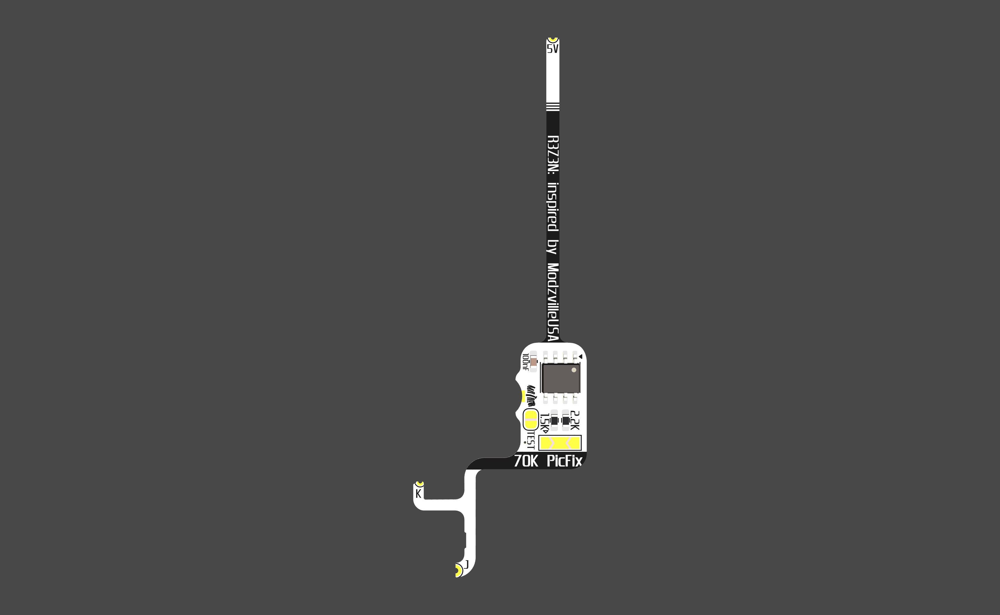
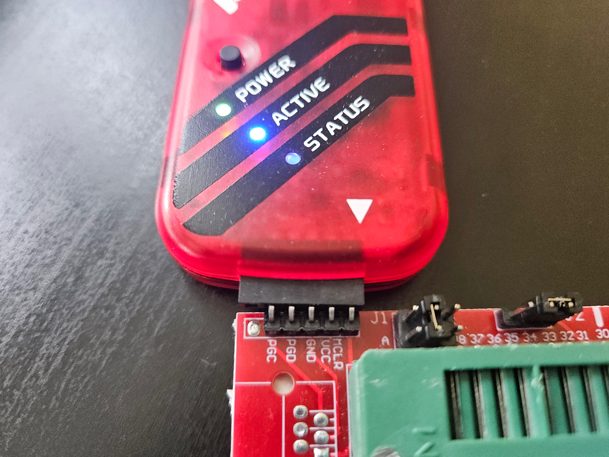
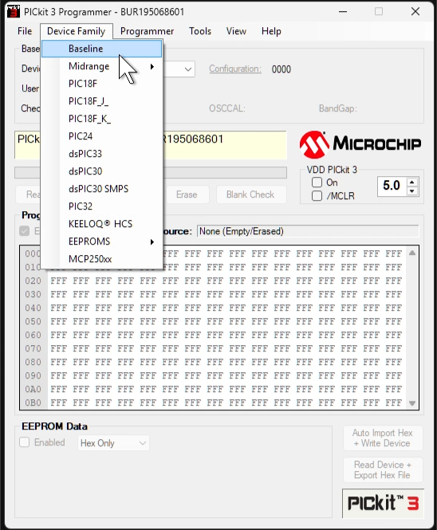
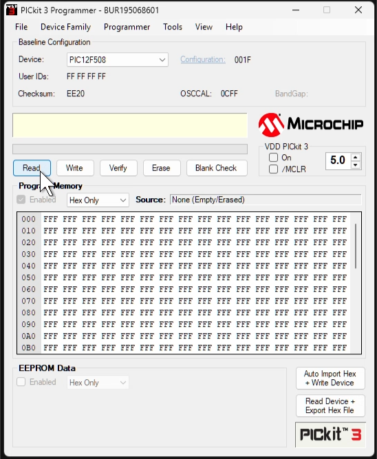
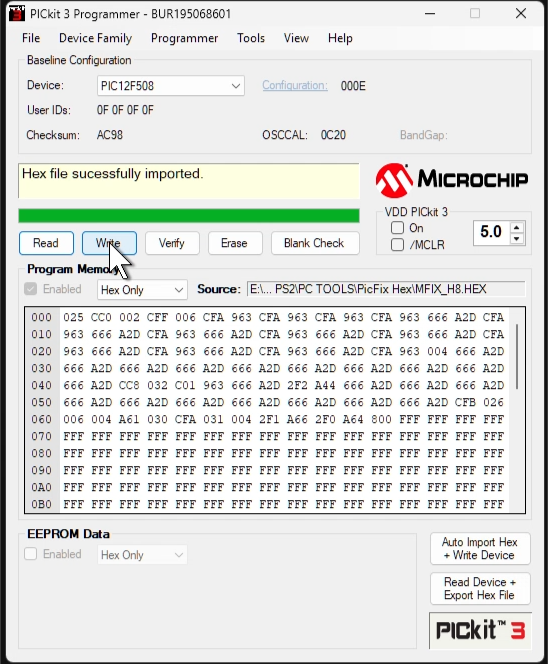

# Matrix PicFix

## What is the PICfix and why is it needed?
Why? In an attempt to curb piracy, $ony designed the laser to fail and burn up. Sadly this [backfired](https://www.gamesindustry.biz/sony-reaches-settlement-in-ps2-disc-read-error-case#:~:text=Now%20a%20settlement%20has%20been,their%20console%20%2D%20at%20SCEA's%20discretion.)

Courtesy of [El Isra](https://github.com/israpps)

Invented by the Matrix Team, they designed a cheap and easy fix for V9-V12 PS2s, documented [here](https://github.com/MechaResearch/MechaPwn/blob/master/docs/PICfix.md) and refined by HaloSlayer255 and [ModzvillUSA](https://modzvilleusa.com/products/ps2-matrix-picfix-for-v9-v12-ps2-consoles)

I (R3Z3N) simply applied some artistic touch to make this an easier install that will look professional with decent soldering skills. CLEAN YOUR FLUX BOYS!

### Models that need the Matrix Picfix

SCPH-390XX The bug is present in this, but triggers much less often.

SCPH-500XX GH-023 and GH-026 motherboards

SCPH-700XX except if your PS2 is the following model with the circutry in red, you DO NOT NEED THIS FIX!

### Mechacon Crash Tester App

El Isra made a PS2 app which identifies if your console is safe, unsafe or uknown. Run the ELF on your PS2 with your desired exploit/elf launcher of choice:

### Appreciation and Thanks to:
[Atheris](https://linktr.ee/atherismods), [SylverRez](https://github.com/m4x10187) and [PCM720](https://github.com/pcm720) for kicad, electrical and logo help! Thanks to [Team Matrix](https://web.archive.org/web/20051228080334/http://infinitymod.com/matrix/) for the code and initial wiring. [ModzvilleUSA](https://modzvilleusa.com/products/ps2-matrix-picfix-for-v9-v12-ps2-consoles), HaloSlayer255 and [Helder](https://heldergametech.com/product-category/ps2/) for rediscovery, documentation, and circuit.

## Purchasing PCBs or Files

 is a better choice for bulk purchases over 10 as it is 30% savings per unit. $10/per or $7/per 10 units and over. Shipping is $7 as it includes tracking. NOTE: product is waiting for Tindie approval

 $10/per and shipping is $7 as it includes tracking. Gerbers, BOM and Placement file here as well!

If you are an installer and would like a sample, please let me [know!](mailto:info@ps2modchiptutorials.com)

### SCPH-500XX Flex PCB

#### GH-023 aka V9

-   SCPH-500XX GH0-23 Flex Front

    ---

    Placeholder, not completed

-   SCPH-500XX GH-023 Flex Rear

    ---

    Placeholder, not completed

-   Installed (pics to come)

    ---

    Placeholder, not completed

#### GH-026 aka V10

    
-   SCPH-500XX GH-026 Flex Front

    ---

    

-   SCPH-500XX GH-026 Flex Rear

    ---

    

-   Installed (pics to come)

    ---

    Picture Placeholder

    

### SCPH-700XX Flex PCB

    
-   SCPH-700XX Flex Front

    ---

    

-   SCPH-700XX Flex Rear

    ---

    

-   SCPH-700XX Install Diagram

    ---

    

-   SCPH-700XX Installed

    ---

    

    

## Parts Needed

These are needed if you purchased a bare flex PCB from me, or are designing your own based off [ModzVillUSA's circuit](https://github.com/MechaResearch/MechaPwn/tree/master/docs/Matrix%20PIC/Gerber).

[100nF 0603 Capacitor](https://www.mouser.com/c/passive-components/capacitors/ceramic-capacitors/mlccs-multilayer-ceramic-capacitors/multilayer-ceramic-capacitors-mlcc-smd-smt/?capacitance=0.1%20uF&case%20code%20-%20in=0603&length=1.6%20mm%20%280.063%20in%29&termination=Standard&tolerance=10%20%25&voltage%20rating%20dc=25%20VDC&width=0.8%20mm%20%280.031%20in%29&instock=y&sort=pricing)

[1.5K Ohm 0603 Resistor](https://www.mouser.com/c/passive-components/resistors/smd-resistors-chip-resistors/thick-film-resistors/?case%20code%20-%20in=0603&packaging=Cut%20Tape&power%20rating=250%20mW%20%281%2F4%20W%29~~333%20mW%20%281%2F3%20W%29&resistance=1.5%20kOhms&tolerance=5%20%25&instock=y&sort=pricing&rp=passive-components%2Fresistors%2Fsmd-resistors-chip-resistors%2Fthick-film-resistors%7C~Power%20Rating)

[2.2K Ohm 0603 Resistor](https://www.mouser.com/c/passive-components/resistors/smd-resistors-chip-resistors/thick-film-resistors/?case%20code%20-%20in=0603&packaging=Cut%20Tape&power%20rating=250%20mW%20%281%2F4%20W%29~~333%20mW%20%281%2F3%20W%29&resistance=2.2%20kOhms&tolerance=5%20%25&instock=y&sort=pricing&rp=passive-components%2Fresistors%2Fsmd-resistors-chip-resistors%2Fthick-film-resistors%7C~Power%20Rating)

[PIC 12F508 IC SOIC-8 Package](https://www.mouser.com/ProductDetail/Microchip-Technology/PIC12F508-I-SN?qs=mcPJWgAPNrfwaHSjpX90MQ%3D%3D)

Pic 12F508 files, choose based on your programmer:

[MFIX_H8.HEX](assets/picfix/MFIX_H8.HEX)

[MFIX_H16.HEX](assets/picfix/MFIX_H16.HEX)

### Tools needed:

[:material-cloud-download: PicKit 3 Programmer Software 3.10](assets/picfix/PICkit3%20Programmer%20Application%20Setup%20v3.10.zip)

[PicKit 3](https://www.amazon.com/Gosono-PICKIT3-Programmer-Programming-Universal/dp/B07D1443M5/ref=sr_1_13_sspa?crid=2T75QRA5FHZDI&dib=eyJ2IjoiMSJ9.YevQ8Jf0hTdiqUtSofPn9aQN35WtDal5rQHtHAFc6W6zPtKX7LZky4ZC4m7z0KeY4cNpvX01FMz3HNMwouxwub8csjFjD9uYDBTkE64VUWVNeYa04OkCtY0yMC2nACelf_7Pds0z8L1rZAVKml-Fwa30i4t2NcAAz7WRm42R9LkCOD7E9C9_T-O29B3sPvp6PsSdu0bl8Sk6yJUrMsRmwG_sO0rW3--F4y-m-c3-yz0K-RKAwMMX_ku8yTvkcpJDp4EF4ZLvntKw00hqDq99cTU0GSktjWLmtCuqmOnOFms.ss9JZldEX7IeF-1XSAfcpQwL7uqoHXkjZLyh78jlaFI&dib_tag=se&keywords=pic+kit+3&qid=1743917759&s=industrial&sprefix=pic+kit+3%2Cindustrial%2C150&sr=1-13-spons&sp_csd=d2lkZ2V0TmFtZT1zcF9tdGY&psc=1)

[SOP8 to DIP8 adapter](https://www.amazon.com/HiLetgo-Programmer-Adapter-Socket-Converter/dp/B01HTC5DKS/ref=sr_1_5?crid=2UBCL6KVM78KW&dib=eyJ2IjoiMSJ9.0YtQZfQXY8SM_my4pw3Wp7w_zM3WItFnLhs9jBkH_YEiGTXrB2-ZpUPMZmPnI1jAVSFudzCoLeNbiC6bhV8jo7jxFkhXp56jsdliK5SHjxIiMoIzB6rlV0wtNVJK131NK7ugAmFtRJhUxqYojQtj03JX2azkew_zxVkDBT6VF1XI92JY-7Ke3ZO0HRRKYnvsgWPPfRszVEBvGCW9Fc6_lbPPJtGS76fkVCN2C-hGDfQ.N9zJPfDjsMyo4oBLfYXw0N8hqByAffVQ5wub2oZIM-U&dib_tag=se&keywords=soic+adapter&qid=1743917897&sprefix=soic+adapter%2Caps%2C180&sr=8-5)

### Programmming the PIC12F508

This is neededed if you provided your own parts. If you purchased assembled from me, this will have been completed!

1.  Plug in the PicKit 3, SOP8 to DIP8 Adapter and seat as shown:

    

    
    -   Programmer to Seat PCB
    
        ---
    
        
    
    
    -   Socketing the adapter
    
        ---
    
        

    -   Seat Jumper Settings

        ---

        

    
    

2.  PicKit 3 Software install and setup:

    1.  Download install and run the [PicKit 3](assets/picfix/PICkit3%20Programmer%20Application%20Setup%20v3.10.zip) software.

    2.  Install the PICkit Operating System by going to: 
    
    "Tools>Download PICkit Operating System".
    
    Navigate to where you installed PicKit 3 and select "PK3OSV020005.hex". Most likely located at:
    
    "C:\Program Files (x86)\Microchip\PICkit 3 v3\PK3OSV020005.hex"

3.  Programming your PIC12F508

    

    
    -   Step 1: Device Family>Baseline
    
        ---
    
        
    
    
    -   Step 2: Select Device>PIC12F508
    
        ---
    
        

    -   Step 3: Read your PIC12F508

        ---

        

        We do this to ensure our OSSCAL (oscilator tuning) is not lost

    -   Step 4: Import Hex
    
        ---

        

    -   Step 5: Write to PIC12F508

        ---

        

    
    

### Testing your PIXFix PCB

1. Solder all points except K into your PS2. Note: PS2 should be unplugged from mains power!

2.  Bridge TEST and the 1.5K resistor solder pad.

2.  Using Kapton Tape, place a tiny piece under point K to avoid connecting/shorts.

3.  Verify no solder bridges elsewhere!

4.  With your power button board connected to PS2, plug PS2 into power.

5.  Press the power button on your PS2. Power should come on (green light), then off after 3 seconds.

    1.  If the PS2 did not power on, then we need a different resistor value.

    2.  Disconnect your PS2 from power
    
    3.  Desolder your existing resistor bridge, and bridge the other resistor pad.

    4.  Go back to step 5 and retest. If step 5 is succes go to step 6.

6.  Desolder the TEST pads

7.  Solder the K point

8.  Reassemble PS2. You now have the famous Team Matrix PICFix installed! Thanks to ModzvilleUSA/HaloSlayer255 and Helder for rediscovering, and designing the main circuit.