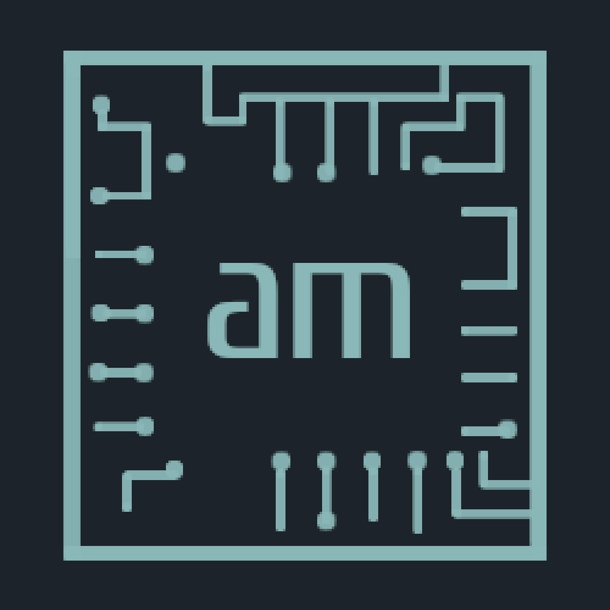

# Thanks in no particular order to:

-   __SylverRez__

    ---

    Modchip Github Repository

    [SylverRez and his modchip repository](https://github.com/m4x10187/ps2-modchip-files)

-   __Will's Console Mods__

    ---

    Showcase of just about every PS2 Modchip

    { width="150" alight="middle" }

    [Wills Modchip Collection](https://www.willsconsolemodifications.co.uk/ps2-wiki/chips.php)

-   __Atheris Mods__

    ---

    PCB/Soldering help and documentation

    { width="150" alight="middle" }

    [Atheris Mods UK](https://linktr.ee/atherismods)

-   __Modzville USA__

    ---

    Modchip Installs

    { width="150" alight="middle" }

    [Modzville USA](https://modzvilleusa.com/)

